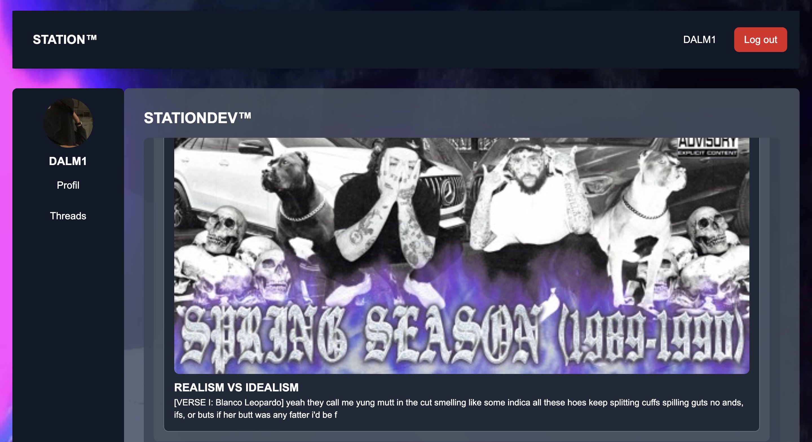

#  STATION™

Bienvenue dans **STATION™**, une application de chat moderne permettant aux utilisateurs de rejoindre des salons de discussion, d'envoyer des messages et de personnaliser leur expérience.


#  STATION™
---

## Ruby version

- **Ruby** : 3.1.2
- **Rails** : 7.1.4.1

---

## System dependencies

- **Base de données** : PostgreSQL (ou tout autre SGBD compatible)
- **Gems clés** :
  - Devise (pour l'authentification)
  - Tailwind CSS (pour le design)
  - ActiveStorage (pour le téléchargement des fichiers, avatars, et arrière-plans)
  - Stimulus.js (pour la gestion de certaines interactions côté front-end)

---

## Configuration

1. Clone le repository :

   ```bash
   git clone https://github.com/username/station.git
   cd station
